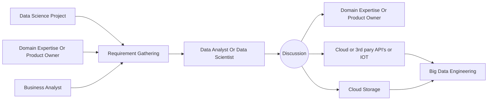
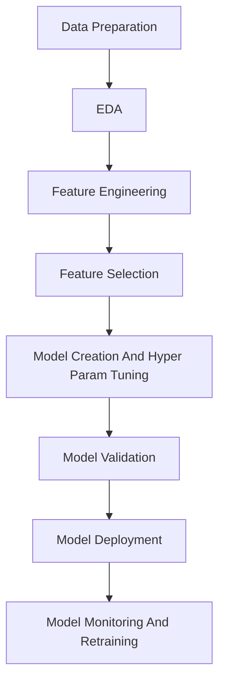

# Contents
- Setup
    - [Proxmox set up for gpu passthrough](#proxmox-set-up-for-gpu-passthrough)
    - [Ubuntu server setup](#ubuntu-server--for-maxmimum-hardware-usage)
    - [nividia gpu power limit in ubuntu server](#nividia-gpu-power-limit-in-ubuntu)
    - [auto set gpu fan speed at boot](#auto-set-gpu-fan-speed-at-boot)
    - [using podman ubuntu fedora as a podman os vs code ssh for lightweight dev environments](#using-podman--ubuntufedora-as-a-podman-os-vs-code-ssh-for-lightweight-dev-environments)
    - [Run jupyterlab inside podman or docker with anaconda on ubuntu](#run-jupyterlab-inside-podman-with-anaconda-on-ubuntu)
    - [CPU frequency control in ubuntu server](#cpu-frequency-control-in-ubuntu-server)
    - [All Installed Package](#all-install-package)
    - [All Upgrade Package](#all-upgrade-package)
    - [MOK reset](#mok-reset)
- ML
    - Online resources. Colah's blog
    - [Confusion Matrix](#confusion-matrix)
    - [Data Science Project Task](#data-science-project-task)
    - [Life Cycle Of Data Science Project](#life-cycle-of-data-science-project)   
    - [sklearn.metrics usage purpose](#sklearnmetrics-usage-purpose)

- DL
    - [Activation function](#activation-function)
    - [Different RNN architecture](#different-rnn-architecture)
     - <a href="https://github.com/Arannamoy-Mondal/AI-ML-DL/blob/main/version%202/DL/Readme.md">More</a>
# Proxmox set up for gpu passthrough
#### 🛠️ Edit GRUB
- Open the GRUB configuration file:

```bash
nano /etc/default/grub
```

- Find the following line: `GRUB_CMDLINE_LINUX_DEFAULT="quiet"`

- Replace it with: 

```txt
GRUB_CMDLINE_LINUX_DEFAULT="quiet intel_iommu=on iommu=pt pcie_acs_override=downstream, multifunction nofb nomodeset video=vesafb:off,efifb:off"
```

#### 🔄 Update GRUB

```bash
update-grub
```

📦 Load Required Modules

- Edit the modules file:

```bash
nano /etc/modules
```

- Add the following lines:

```txt
vfio
vfio_iommu_type1
vfio_pci
vfio_virqfd
```

#### ⚙️ IOMMU Remapping

- a) Allow Unsafe Interrupts

```bash
nano /etc/modprobe.d/iommu_unsafe_interrupts.conf
```
- Add:

```bash
options vfio_iommu_type1 allow_unsafe_interrupts=1
```

- b) Ignore MSRs

```bash
nano /etc/modprobe.d/kvm.conf
```

- Add:

```bash
options kvm ignore_msrs=1
```

#### 🚫 Blacklist Host GPU Drivers

- Prevent the default GPU drivers from loading:

```bash
nano /etc/modprobe.d/blacklist.conf
```

- Add the following lines:

```bash
blacklist radeon
blacklist nouveau
blacklist nvidia
blacklist nvidiafb
```

#### 🎯 Bind GPU to VFIO

- a) Identify Your GPU

```bash
lspci -v
```

- b) Get Vendor IDs:

```bash
lspci -n -s 01:00.0
```

- c) Add IDs to VFIO

```bash
nano /etc/modprobe.d/vfio.conf
```

- Add the following line (replace with your actual IDs):

```bash
options vfio-pci ids=10de:1b80,10de:10f0 disable_vga=1
```

- ids=...: Lists device/vendor IDs of GPU and its audio function.
- disable_vga=1: Tells VFIO to disable VGA compatibility (important for multi-GPU systems).


#### 🔁 Final Update and Reboot

```bash
update-initramfs -u && reboot
```


- [List Of Contents](#setup)
# Ubuntu server ( For maxmimum hardware usage)

#### Install NVIDIA Driver

```bash
sudo ubuntu-drivers install
```


#### Auto-Set GPU Fan Speed at Boot
- N.B. No display output for this.
- 1. Enable Coolbits in X config: Ensure /etc/X11/xorg.conf has.

```bash
Section "Device"
    Identifier     "Device0"
    Driver         "nvidia"
    Option         "Coolbits" "4"
EndSection
```
- If it doesn’t exist:

```bash
sudo nvidia-xconfig --cool-bits=4
```

- 2. Install necessary packages

```bash
sudo apt update && apt install xserver-xorg-core xinit nvidia-settings -y
```

- 3. Create a script for auto fan speed: Create a file to start X and apply settings.

```bash
sudo nano /usr/local/bin/start-gpu-fan.sh
```
- Paste it:

```bash
#!/bin/bash

# Start X server in the background
X :0 &

# Wait for X to initialize
sleep 5

# Set display environment
export DISPLAY=:0
export XAUTHORITY=/root/.Xauthority

# Enable manual fan control and set to 100%
nvidia-settings -a "[gpu:0]/GPUFanControlState=1"
nvidia-settings -a "[fan:0]/GPUTargetFanSpeed=100"
```

- Make it executable:

```bash
sudo chmod +x /usr/local/bin/start-gpu-fan.sh
```

- 4. Create a systemd service
```bash
sudo nano /etc/systemd/system/gpu-fan.service
```

- Paste it:

```bash
#!/bin/bash
[Unit]
Description=Set NVIDIA GPU fan speed
After=multi-user.target

[Service]
Type=oneshot
ExecStart=/usr/local/bin/start-gpu-fan.sh
RemainAfterExit=true

[Install]
WantedBy=multi-user.target
```
- Enable the service:

```bash
sudo systemctl daemon-reexec
sudo systemctl enable gpu-fan.service
sudo reboot
```

- [List Of Contents](#setup)
# NIVIDIA Gpu Power Limit In Ubuntu

- 1. Create script:

```bash
sudo nano /usr/local/bin/gpu-power-limit.sh
```

- Add these lines
```bash
#!/bin/bash
nvidia-smi -pm 1
nvidia-smi -pl 120 # power can be set 120W , anyone can change it depend on his demand.
```

- 2. Make it executable:

```bash
sudo chmod +x /usr/local/bin/gpu-power-limit.sh
```
- 3. Create systemd service:

```bash
sudo nano /etc/systemd/system/gpu-power-limit.service
```

```bash
[Unit]
Description=Set GPU Power Limit
After=multi-user.target

[Service]
ExecStart=/usr/local/bin/gpu-power-limit.sh
Type=oneshot
RemainAfterExit=true

[Install]
WantedBy=multi-user.target
```

- 4. Enable it:

```bash
sudo systemctl daemon-reexec 
sudo systemctl enable gpu-power-limit.service
sudo systemctl start gpu-power-limit.service
systemctl status gpu-power-limit.service
```


- [List Of Contents](#setup)
# Using Podman + Ubuntu/Fedora As A Podman OS+ VS Code SSH for Lightweight Dev Environments

#### 🐳 Step 1: Run an Ubuntu Container

`For Ubuntu Container:`

```bash
podman run -it --name Ubuntu-Dev -v /home/customDir/:/home/ubuntu:z -p 2020:22 -p 80:8080 -p 3000:3000 -p 5000:5000 -p 8888:8888 ubuntu
```

`For Fedora Container:`

```bash
podman run -it --name Ubuntu-Dev -v /home/customDir/:/home/fedora:z -p 2020:22 -p 80:8080 -p 3000:3000 -p 5000:5000 -p 8888:8888 fedora
```

#### 🛠️ Step 2: Set Up SSH Server in the Container

`For Ubuntu Container:`

```bash
apt update && apt install -y openssh-server sudo curl git nano libatomic1
```

`For Fedora Container:`

```bash
dnf update && dnf install openssh-server git nano curl sudo 
```
- Set a password for root (only for local development):

```bash
passwd root
```
- Edit the SSH configuration:

```bash
nano /etc/ssh/sshd_config
```

- Make sure the following lines are present and uncommented:

```bash
PermitRootLogin yes
PasswordAuthentication yes
```

- Start the SSH server:
`For Ubuntu Container:`

```bash
service ssh start
```

`For Fedora Container:`

```bash
ssh-keygen -A
/usr/bin/sshd
```

- Set Up VS Code SSH Access

```bash
Host ubuntu-dev
  HostName 127.0.0.1
  Port 2020
  User root
```

- Or:

```bash
    ssh root@localhost -p 2020
```


- [List Of Contents](#setup)

# Run JupyterLab Inside Podman with Anaconda on Ubuntu

#### 🛠️ Step 1: Launch an Ubuntu Container with Podman
- Start a new Ubuntu container with port forwarding:

```bash
podman run -it --name Ubuntu -p 8888:8888 ubuntu
```
- `-p 8888:8888` exposes JupyterLab to your host.

#### 📦 Step 2: Install Dependencies Inside the Container

```bash
apt update && apt install -y wget
```

#### 🌐 Step 3: Download and Install Anaconda:
- Follow the anaconda installation doc for this.

#### 🧪 Step 4: Create and Activate a Conda Environment

```bash
conda create -n my-env python=3.11 -y
conda activate my-env
conda env list
```

#### 💡 Step 5: Install and Launch JupyterLab

- Install JupyterLab:

```bash
conda install jupyterlab
```

- Launch jupyter lab:

```bash
jupyter lab --ip=0.0.0.0 --port=8888 --no-browser --allow-root
```

- Use `--allow-root` because you're inside a container running as root. Otherwise, it not run perfectly.


- [List Of Contents](#setup)
# CPU frequency control in ubuntu server


```bash
sudo cpupower frequency -u 6.0GHz -d 3.0GHZ
```

#### Autostart up this programme:

```bash
[Unit]
Description=Lock Performance
After=network.target

[Service]
Type=oneshot
User=root
#ExecStart=
ExecStart=cpupower frequency-set -u 2.8GHz
ExecStart=cpupower frequency-set -d 2.8GHz
RemainAfterExit=yes

[Install]
WantedBy=multi-user.target
```

`Extra:`

- For repeated programme like as airflow server with astronomer

```bash
[Unit]
Description=algo-4
After=network.target

[Service]
User=root
ExecStart=
Restart=always
RestartSec=1

[Install]
WantedBy=multi-user.target
```

- Run without password:

```bash
sudo visudo
```

```bash
username ALL=(ALL) NOPASSWD: /usr/bin/cpupower
```

`Just run this command no password needed:`

```bash
sudo cpupower frequency-set -u 6.0GHz
```


# Sample yaml configuration for continue

```yml
name: Local Config
version: 1.0.0
schema: v1
models: 
  - name: "translategemma:latest"
    provider: "ollama"
    model: "translategemma:latest"
    apiBase: "http://localhost:11434"
    roles:
      - chat
      - edit
      - apply
```


# Set a default env in anaconda

```bash
conda config --show auto_activate
conda config --set auto_activate_base false
```

- Close the terminal and reopen terminal

```bash
echo "conda activate conda-env-3-12" >> ~/.bashrc
```

- Close the terminal and reopen terminal

# Remove a conda env
```bash
conda deactivate
conda remove --name conda-env-3-12 --all
```

# All install package

```bash
grep "install " /var/log/dpkg.log | tail -n 100
```

# All upgrade package
```bash
grep "upgrade " /var/log/dpkg.log | tail -n 100
```
# MOK reset
```bash
sudo mokutil --import /var/lib/shim-signed/mok/MOK.der
```

# Confusion Matrix  
|Metric|Prediction|Actual Reality|Definition|Note|
|-------|----------|-------------|----------|----------|
|TP|True (Positive)|True (Positive)|Model correctly identified a positive case.|Success
|TN|False (Negative)|False (Negative)|Model correctly identified a negative case.|Success
|FP|True (Positive)|False (Negative)|Model said Yes, but it was actually No.|Type I Error (False Alarm)
|FN|False (Negative)|True (Positive)|Model said No, but it was actually Yes.|Type II Error (Missing Opportunity) 

#### $$Precision=\frac{TP}{TP+FP}$$
#### $$Recall=\frac{TP}{TP+FN}$$
#### $$Accuracy=\frac{TP}{TP+FP+FN+TN}$$

# Data Science Project task




# Life Cycle Of Data Science Project



# mlflow
- serving play --> input

```bash
mlflow ui
```

```python
import mlflow
mlflow.set_tracking_uri("http://127.0.0.1:5000")
mlflow.set_experiment(experiment_name="000 set up.ipynb")
with mlflow.start_run():
    model=LogisticRegression()
    model.fit(X_test,y_test)
    y_pred=model.predict(X_train)
    accuracy=accuracy_score(y_pred,y_train)
    signature=infer_signature(X_test,model.predict(X_train))
    mlflow.log_input(dataset=mlflow.data.from_numpy(X_test,"iris_dataset"),context="iris_dataset")
    mlflow.set_tag("Training Info","Basic LR model for iris dataset")
    model_info=mlflow.sklearn.log_model(
        sk_model=model,
        signature=signature,
        artifact_path="iris_model",
        input_example=X_test,
        registered_model_name="000 set up"
    )
```

`load model`

```python
model=mlflow.pyfunc.load_model(model_info.model_uri)

```


#### sklearn.metrics usage purpose

`sklearn.metrics` is a comprehensive module in scikit-learn that provides tools to evaluate the quality of predictions. Here is a complete breakdown organized by purpose:

---

## 1. Classification Metrics

These evaluate how well a model predicts discrete class labels.

| Function | Purpose |
|----------|---------|
| `accuracy_score` | Fraction of correct predictions. Best for **balanced** datasets. |
| `precision_score` | Of all predicted positives, how many were actually positive. |
| `recall_score` | Of all actual positives, how many were correctly identified. |
| `f1_score` | Harmonic mean of precision and recall. Good for **imbalanced** data. |
| `fbeta_score` | Generalized F-measure where you control the weight of precision vs recall via `beta`. |
| `classification_report` | Generates a full summary table with precision, recall, f1-score, and support per class. |
| `confusion_matrix` | A table showing true vs predicted counts (TP, TN, FP, FN). |
| `roc_auc_score` | Area under the ROC curve. Measures separability between classes. |
| `roc_curve` | Computes the False Positive Rate and True Positive Rate at various thresholds. |
| `precision_recall_curve` | Computes precision-recall pairs at different probability thresholds. |
| `average_precision_score` | Area under the precision-recall curve. Good for imbalanced datasets. |
| `log_loss` | Negative log-likelihood. Used when models output probabilities. Lower is better. |
| `jaccard_score` | Similarity between predicted and actual sets (intersection over union). |
| `hamming_loss` | Fraction of labels that are incorrectly predicted. Used in multilabel problems. |
| `zero_one_loss` | Fraction of misclassifications (0-1 loss). |
| `matthews_corrcoef` | Correlation between predicted and actual. Range [-1, 1]. Robust for imbalanced data. |
| `cohen_kappa_score` | Measures agreement between two raters (model vs truth), accounting for chance. |
| `balanced_accuracy_score` | Average of recall obtained on each class. Adjusts for class imbalance. |
| `top_k_accuracy_score` | Checks if the true label is in the top k predicted labels. |
| `hinge_loss` | Loss function used by SVMs. |
| `brier_score_loss` | Measures accuracy of probabilistic predictions. Good for calibrated models. |

---

## 2. Regression Metrics

These evaluate how well a model predicts continuous values.

| Function | Purpose |
|----------|---------|
| `mean_absolute_error` (MAE) | Average absolute difference between predicted and actual. Robust to outliers. |
| `mean_squared_error` (MSE) | Average squared difference. Penalizes large errors more heavily. |
| `root_mean_squared_error` (RMSE) | Square root of MSE. Same units as the target variable. |
| `mean_squared_log_error` (MSLE) | MSE on log-transformed targets. Useful when targets grow exponentially. |
| `median_absolute_error` | Median of absolute differences. Very robust to outliers. |
| `r2_score` | Coefficient of determination. Proportion of variance explained (1 = perfect). |
| `explained_variance_score` | Measures how much variance the model explains vs the mean. |
| `max_error` | Maximum residual error. Shows the worst-case prediction. |
| `mean_absolute_percentage_error` (MAPE) | Average percentage error. Useful for relative comparisons. |
| `mean_pinball_loss` | Used for quantile regression. |
| `d2_absolute_error_score` | R²-like score using MAE as baseline. |
| `d2_pinball_score` | R²-like score for quantile regression. |

---

## 3. Multilabel Ranking Metrics

Used when each sample can belong to multiple classes, and you want to rank them.

| Function | Purpose |
|----------|---------|
| `coverage_error` | Average number of labels that must be included to cover all true labels. |
| `label_ranking_average_precision_score` | Average precision for each sample's label ranking. |
| `label_ranking_loss` | Average number of label pairs that are incorrectly ordered. |

---

## 4. Clustering Metrics

These evaluate the quality of clustering algorithms (unsupervised learning).

| Function | Purpose |
|----------|---------|
| `adjusted_rand_score` | Similarity between two clusterings, corrected for chance. Range [-1, 1]. |
| `rand_score` | Raw similarity between two clusterings (no chance correction). |
| `adjusted_mutual_info_score` | Mutual information between clusterings, adjusted for chance. |
| `mutual_info_score` | Measures dependency between two clusterings. |
| `normalized_mutual_info_score` | Mutual information normalized to [0, 1]. |
| `homogeneity_score` | Clusters contain only members of a single class. |
| `completeness_score` | All members of a given class are in the same cluster. |
| `v_measure_score` | Harmonic mean of homogeneity and completeness. |
| `fowlkes_mallows_score` | Geometric mean of precision and recall for clustering. |
| `silhouette_score` | Measures how similar an object is to its own cluster vs others. Range [-1, 1]. |
| `silhouette_samples` | Silhouette coefficient for each individual sample. |
| `calinski_harabasz_score` | Ratio of between-cluster dispersion to within-cluster dispersion. Higher is better. |
| `davies_bouldin_score` | Average similarity ratio of each cluster with its most similar cluster. Lower is better. |
| `contingency_matrix` | Cross-tabulation of true class labels and cluster labels. |
| `pair_confusion_matrix` | Confusion matrix for pairs of samples (clustered together or not). |
| `dendrogram` | Visualizes hierarchical clustering (from `scipy` integration). |

---

## 5. Pairwise Metrics & Distances

These compute distances or similarities between samples.

| Function | Purpose |
|----------|---------|
| `euclidean_distances` | Straight-line distance between vectors. |
| `manhattan_distances` | Sum of absolute differences (L1 distance). |
| `cosine_similarity` | Cosine of the angle between vectors (ignores magnitude). |
| `cosine_distances` | 1 - cosine_similarity. |
| `pairwise_distances` | Computes distance matrix using various metrics. |
| `pairwise_kernels` | Computes kernel matrix (e.g., linear, polynomial, RBF). |
| `rbf_kernel` | Radial Basis Function kernel. |
| `polynomial_kernel` | Polynomial kernel for SVMs. |
| `sigmoid_kernel` | Sigmoid/tanh kernel. |
| `laplacian_kernel` | Laplacian/exponential kernel. |
| `chi2_kernel` | Kernel for histogram-based features. |
| `linear_kernel` | Simple dot product kernel. |
| `haversine_distances` | Great-circle distance on a sphere (for GPS coordinates). |

---

## 6. Text & NLP Metrics

| Function | Purpose |
|----------|---------|
| `jaccard_score` | Also used for text similarity (token overlap). |

---

## Quick Reference: Which One Should You Use?

| Scenario | Recommended Metric |
|----------|-------------------|
| Balanced binary classification | `accuracy_score`, `f1_score` |
| Imbalanced binary classification | `roc_auc_score`, `average_precision_score`, `f1_score`, `matthews_corrcoef` |
| Multi-class classification | `f1_score` (weighted/macro), `classification_report` |
| Probabilistic predictions | `log_loss`, `brier_score_loss`, `roc_auc_score` |
| Regression (general) | `r2_score`, `mean_squared_error` |
| Regression (outliers present) | `mean_absolute_error`, `median_absolute_error` |
| Regression (percentage errors) | `mean_absolute_percentage_error` |
| Clustering (with ground truth) | `adjusted_rand_score`, `normalized_mutual_info_score` |
| Clustering (without ground truth) | `silhouette_score`, `calinski_harabasz_score` |
| Model comparison / threshold tuning | `precision_recall_curve`, `roc_curve` |

---


### Activation function

| Function         | Formula                                                                                | Domain                | Range                      | Derivative $f'(x)$                                                                 | Primary Purpose                                          |
| :--------------- | :------------------------------------------------------------------------------------- | :-------------------- | :------------------------- | :--------------------------------------------------------------------------------- | :------------------------------------------------------- |
| **ReLU**         | $\max(0, x)$                                                                           | $(-\infty, \infty)$   | $[0, \infty)$              | $\begin{cases} 0 & x < 0 \\ 1 & x > 0 \end{cases}$                                 | Default CNN/MLP hidden layers                            |
| **LeakyReLU**    | $\max(0,x) + \alpha\min(0,x)$                                                          | $(-\infty, \infty)$   | $(-\infty, \infty)$        | $\begin{cases} \alpha & x < 0 \\ 1 & x > 0 \end{cases}$                            | Fix dying ReLU (keeps small gradient for negatives)      |
| **PReLU**        | $\max(0,x) + \alpha\min(0,x)$                                                          | $(-\infty, \infty)$   | $(-\infty, \infty)$        | $\begin{cases} \alpha & x < 0 \\ 1 & x > 0 \end{cases}$                            | LeakyReLU where $\alpha$ is **learnable**                |
| **RReLU**        | $\max(0,x) + \alpha\min(0,x)$                                                          | $(-\infty, \infty)$   | $(-\infty, \infty)$        | $\begin{cases} \alpha & x < 0 \\ 1 & x > 0 \end{cases}$                            | LeakyReLU where $\alpha$ is **random** per forward pass  |
| **ELU**          | $\begin{cases} x & x \ge 0 \\ \alpha(e^x - 1) & x < 0 \end{cases}$                     | $(-\infty, \infty)$   | $(-\alpha, \infty)$        | $\begin{cases} 1 & x \ge 0 \\ \alpha e^x & x < 0 \end{cases}$                      | Smooth negative saturation, mean closer to zero          |
| **SELU**         | $\lambda \cdot \text{ELU}(x)$                                                          | $(-\infty, \infty)$   | $(-\lambda\alpha, \infty)$ | $\begin{cases} \lambda & x \ge 0 \\ \lambda\alpha e^x & x < 0 \end{cases}$         | Self-normalizing networks (no BatchNorm needed)          |
| **GELU**         | $x \cdot \Phi(x) = \frac{x}{2}\left(1 + \text{erf}\frac{x}{\sqrt{2}}\right)$           | $(-\infty, \infty)$   | $(-\infty, \infty)$        | $\Phi(x) + x \cdot \phi(x)$                                                        | **Transformers** (BERT, GPT, ViT); smooth, probabilistic |
| **SiLU (Swish)** | $x \cdot \sigma(x) = \frac{x}{1+e^{-x}}$                                               | $(-\infty, \infty)$   | $(-\infty, \infty)$        | $\sigma(x) \cdot \big(1 + x(1-\sigma(x))\big)$                                     | Modern CNNs (EfficientNet); self-gated non-linearity     |
| **Mish**         | $x \cdot \tanh\big(\text{softplus}(x)\big)$                                            | $(-\infty, \infty)$   | $(-\infty, \infty)$        | $\tanh(\omega) + x\sigma(x)\text{sech}^2(\omega)$ where $\omega = \ln(1+e^x)$      | Strong alternative to Swish; smooth, non-monotonic       |
| **Softplus**     | $\ln(1 + e^x)$                                                                         | $(-\infty, \infty)$   | $(0, \infty)$              | $\sigma(x) = \frac{1}{1+e^{-x}}$                                                   | Smooth ReLU approximation; some VAEs                     |
| **Tanh**         | $\frac{e^x - e^{-x}}{e^x + e^{-x}}$                                                    | $(-\infty, \infty)$   | $(-1, 1)$                  | $1 - \tanh^2(x) = \text{sech}^2(x)$                                                | RNNs/LSTMs; zero-centered bounded outputs                |
| **Sigmoid**      | $\frac{1}{1 + e^{-x}}$                                                                 | $(-\infty, \infty)$   | $(0, 1)$                   | $\sigma(x)\big(1 - \sigma(x)\big)$                                                 | **Binary output** layers; gating mechanisms              |
| **Softmax**      | $\frac{e^{x_i}}{\sum_j e^{x_j}}$                                                       | $(-\infty, \infty)^n$ | $(0, 1)^n$, sums to 1      | $\frac{\partial f_i}{\partial x_j} = f_i(\delta_{ij} - f_j)$                       | **Multi-class output** layers (probabilities)            |
| **Hardtanh**     | $\max(-1, \min(1, x))$                                                                 | $(-\infty, \infty)$   | $[-1, 1]$                  | $\begin{cases} 0 & \|x\| > 1 \\ 1 & \|x\| < 1 \end{cases}$                         | Bounded activations; efficient on edge devices           |
| **Hardswish**    | $\begin{cases} 0 & x \le -3 \\ x\frac{x+3}{6} & -3 < x < 3 \\ x & x \ge 3 \end{cases}$ | $(-\infty, \infty)$   | $[0, \infty)$              | $\begin{cases} 0 & x < -3 \\ \frac{2x+3}{6} & -3 < x < 3 \\ 1 & x > 3 \end{cases}$ | Mobile/edge deployment (MobileNetV3); fast               |
| **Linear**       | $x$                                                                                    | $(-\infty, \infty)$   | $(-\infty, \infty)$        | $1$                                                                                | **Regression output**; bottleneck layers                 |


### Different RNN architecture
| Architecture                             | Primary Purpose                              | Suitable For                                             | Activation Functions                                                             | Key Trade-offs                                                                                   |
| :--------------------------------------- | :------------------------------------------- | :------------------------------------------------------- | :------------------------------------------------------------------------------- | :----------------------------------------------------------------------------------------------- |
| **Vanilla RNN (Elman)**                  | Baseline sequential modeling                 | Simple time-series, educational demos                    | **Tanh** or **ReLU**                                                             |  Severe vanishing/exploding gradients; unusable for long sequences                              |
| **LSTM**                                 | Long-term dependency learning                | Machine translation, speech recognition, text generation | **Sigmoid** (forget/input/output gates), **Tanh** (candidate cell, hidden state) | Solves vanishing gradients;  4x parameters vs Vanilla RNN; slower training                    |
| **GRU**                                  | Simplified long-term modeling                | Similar to LSTM; often preferred when data is scarce     | **Sigmoid** (reset/update gates), **Tanh** (candidate hidden state)              | Fewer parameters than LSTM; similar accuracy;  Slightly less flexible gating                  |
| **Bidirectional LSTM/GRU**               | Context from both directions                 | NER, POS tagging, sentiment analysis, speech-to-text     | Same as base cell (Sigmoid + Tanh)                                               | Uses future context;  Cannot do real-time streaming; 2x compute                               |
| **Stacked / Deep RNN**                   | Richer hierarchical representations          | Speech recognition, acoustic modeling                    | Same as base cell per layer                                                      | More capacity;  Harder to train; diminishing returns beyond 2–4 layers                        |
| **Peephole LSTM**                        | Precise timing and interval learning         | Rhythm detection, counting tasks, musical timing         | **Sigmoid** (gates see cell state), **Tanh** (candidate)                         | Better temporal precision;  More parameters; marginal gain on most NLP                        |
| **Coupled / CIFG LSTM**                  | Reduce parameters with minimal accuracy loss | Large-scale speech systems (Google ASR)                  | **Sigmoid** (coupled forget/input), **Tanh** (candidate)                         | ~25% fewer params; nearly LSTM accuracy;  Slightly less gating flexibility                    |
| **JANET**                                | Prove forget gate is sufficient              | Research, ablation studies                               | **Sigmoid** (forget only), **Tanh** (candidate)                                  | Very simple; competitive on many tasks;  Input gate removal hurts some complex tasks          |
| **QRNN**                                 | GPU-parallelizable sequence modeling         | Large-batch text classification, language modeling       | **Tanh** (candidate), **Sigmoid** (forget/output)                                | **10–16x faster** than LSTM;  Slightly lower accuracy on some tasks                           |
| **SRU**                                  | Fast training with simple recurrence         | Deep RNN stacks, real-time NLP                           | **Sigmoid** (forget gate)                                                        | **5–10x faster**; trains deeper models;  Less gating than LSTM                                |
| **IndRNN**                               | Stable gradients with ReLU                   | Very deep RNNs, long sequences                           | **ReLU** (main), **Sigmoid** (optional gating)                                   | No vanishing/explosion; **6x faster**;  Neurons don't interact in recurrence                  |
| **uRNN (Unitary RNN)**                   | Theoretically perfect gradient stability     | Extremely long sequences, copying tasks                  | **ModReLU** (complex-valued)                                                     | Eigenvalues = 1; no gradient decay;  Complex numbers; expensive                               |
| **Clockwork RNN**                        | Multi-timescale dynamics                     | Music, video, hierarchical time-series                   | **Tanh**                                                                         | Captures multiple frequencies naturally;  Fixed manual periods                                |
| **NTM (Neural Turing Machine)**          | Algorithmic reasoning with external memory   | Copy, sort, repeat tasks; few-shot learning              | **Sigmoid/Tanh** (controller), **Softmax** (attention)                           | Generalizes to longer sequences;  Hard to train; unstable                                     |
| **DNC (Differentiable Neural Computer)** | Complex structured reasoning                 | Graph navigation, story QA, relational reasoning         | Same as NTM + usage/ allocation gates                                            | Stronger memory management than NTM;  Very complex; slow                                      |
| **ON-LSTM**                              | Hierarchical syntactic structure             | Parsing, language modeling, syntax-aware NLP             | **Sigmoid/Tanh** + **cumulative softmax** (master gates)                         | Learns grammar implicitly;  More complex gating logic                                         |
| **Mamba / S4 / SSMs**                    | Ultra-long sequence modeling                 | Genomics, long-document modeling, audio                  | **SiLU/GELU** (gating), **Linear** (state transition)                            | **Linear complexity**; handles 100k+ tokens;  Newer; less ecosystem support than Transformers |
| **RWKV**                                 | Transformer-quality with RNN inference cost  | Chatbots, long-context LLMs                              | **SiLU**, **Sigmoid** (time-mixing), **Softmax** (channel-mixing)                | Parallel training + linear inference;  Novel architecture; limited research                   |


### RNN usecase

| If you need...                     | Choose                        | Because                                           |
| :--------------------------------- | :---------------------------- | :------------------------------------------------ |
| A reliable default                 | **LSTM** or **GRU**           | Battle-tested, works everywhere                   |
| Real-time streaming                | **LSTM/GRU** (unidirectional) | Bidirectional needs future tokens                 |
| Maximum speed on GPU               | **QRNN** or **SRU**           | Parallelize across time                           |
| Very long sequences (>1k)          | **IndRNN**, **Mamba/S4**      | Stable gradients or linear complexity             |
| Algorithmic/memory tasks           | **NTM** or **DNC**            | Explicit external memory                          |
| Understanding what matters in LSTM | **JANET** or **Coupled LSTM** | Shows forget gate carries the load                |
| Production long-context LLM        | **Mamba** or **RWKV**         | Linear inference cost vs. Transformer's quadratic |


| Scenario                                                    | Better Alternative            | Why                                                |
| :---------------------------------------------------------- | :---------------------------- | :------------------------------------------------- |
| Cross-asset correlation modeling (100+ assets, 1 timestamp) | Transformer or GNN            | Spatial/cross-sectional patterns dominate temporal |
| Image-based fraud (document forgery)                        | CNN / Vision Transformer      | Spatial features, not sequence                     |
| Tabular fraud with no time component                        | XGBoost / TabNet              | No sequence = no need for recurrence               |
| Ultra-long sequences (10k+ time steps)                      | Mamba / S4 / Linear Attention | LSTM gradients still decay over extreme lengths    |
| Need to explain *why* a transaction is fraud                | Attention + Transformer       | Attention weights show which past events mattered  |
