### DeepFindr ->https://www.youtube.com/watch?v=0YLZXjMHA-8&list=PLV8yxwGOxvvoNkzPfCx2i8an--Tkt7O8Z&index=1

### Stanford CS224W: Machine Learning with Graphs -> https://www.youtube.com/watch?v=JAB_plj2rbA&list=PLoROMvodv4rPLKxIpqhjhPgdQy7imNkDn


### https://distill.pub/2021/gnn-intro/?utm_source=chatgpt.com
### Books
- Hands-On-Graph-Neural-Networks-Using-Python
- Deep Learning for the Life Sciences: Applying Deep Learning to Genomics, Microscopy, Drug Discovery, and More
- Graph Representation Learning


### 
- GraphDTA: Predicting drug–target binding affinity with graph neural networks
- Interpretable Drug-Target Prediction Using Graph Attention Networks
- DeepDTA: Deep Drug–Target Binding Affinity Prediction
- A Comprehensive Review of Machine Learning and Deep Learning Methods for Drug-Target Interaction Prediction


## Graph Attention Networks 
> N.B. (Collected from Hands-On-Graph-Neural-Networks-Using-Python)

Graph Attention Networks (GATs) are a theoretical improvement over GCNs. Instead of static normalization coefficients, they propose weighting factors calculated by a process called self-attention. The same process is at the core of one of the most successful deep learning architectures: the transformer, popularized by BERT and GPT-3. Introduced by Veličković et al. in 2017, GATs have become one of the most popular GNN architectures thanks to excellent out-of-the-box performance.

In this chapter, we will learn how the graph attention layer works in four steps. This is actually the perfect example for understanding how self-attention works in general. This theoretical background will allow us to implement a graph attention layer from scratch in NumPy. We will build the matrices by ourselves to understand how their values are calculated at each step.

In the last section, we’ll use a GAT on two node classification datasets: Cora, and a new one called CiteSeer. As anticipated in the last chapter, this will be a good opportunity to analyze our results a little further. Finally, we will compare the accuracy of this architecture with a GCN.

By the end of this chapter, you will be able to implement a graph attention layer from scratch and a GAT in PyTorch Geometric (PyG). You will learn about the differences between this architecture and a GCN. Furthermore, you will master an error analysis tool for graph data.

In this chapter, we’ll cover the following topics:

- Introducing the graph attention layer
- Implementing the graph attention layer in NumPy
- Implementing a GAT in PyTorch Geometric


#### Introducing the graph attention layer

The main idea behind GATs is that some nodes are more important than others. In fact, this was already the case with the graph convolutional layer: nodes with few neighbors were more important than others, thanks to the normalization coefficient 

$\frac{1}{\sqrt(deg(i)(deg(j)))}$


This approach is limiting because it only takes into account node degrees. On the other hand, the goal of the graph attention layer is to produce weighting factors that also consider the importance of node features.

Let’s call our weighting factors attention scores and note, $a_{ij}$ , the attention score between the nodes  and . We can define the graph attention operator as follows: $h_i=\sum_{j\epsilon N_i}\alpha_{ij}Wx_j$

An important characteristic of GATs is that the attention scores are calculated implicitly by comparing inputs to each other (hence the name self-attention). In this section, we will see how to calculate these attention scores in four steps and also how to make an improvement to the graph attention layer:
- Linear transformation
- Activation function
- Softmax normalization
- Multi-head attention
- Improved graph attention layer

##### Linear transformation

The attention score represents the importance between a central node i  and a neighbor j. As stated previously, it requires node features from both nodes. In the graph attention layer, it is represented by a concatenation between the hidden vectors $Wx_i$  and $Wx_j$,$[Wx_i||Wx_j]$ . Here, W is a classic shared weight matrix to compute hidden vectors. An additional linear transformation is applied to this result with a dedicated learnable weight matrix $W_{att}$. During training, this matrix learns weights to produce attention coefficients $a_{ij}$. This process is summarized by the following formula:$a_{ij}=W_{att}^T[Wx_i||Wx_j]$.This output is given to an activation function like in traditional neural networks.

##### Activation function
Nonlinearity is an essential component in neural networks to approximate nonlinear target functions. Such functions could not be captured by simply stacking linear layers, as their final outcome would still behave like a single linear layer.

In the official implementation (https://github.com/PetarV-/GAT/blob/master/utils/layers.py), the authors chose the Leaky Rectified Linear Unit (ReLU) activation function. ReLU does not work in less or equal 0 but leaky relu solved it.This is implemented by applying the Leaky ReLU function to the output of the previous step:$e_{ij}=LeakyReLU(a_{ij})$.However, we are now facing a new problem: the resulting values are not normalized!

##### Softmax normalization
We want to compare different attention scores, which means we need normalized values on the same scale. In machine learning, it is common to use the softmax function for this purpose. Let’s call $N_i$ the neighboring nodes of node i, including itself:
$a_{ij}=softmax_j(e_{ij})=\frac{exp(e_{ij})}{\sum_{k\epsilon N_i} exp(e_{i,k})}$.The result of this operation gives us our final attention scores $a_{ij}$. But there’s another problem: self-attention is not very stable.

##### Multi-head attention
This issue was already noticed by Vaswani et al. (2017) in the original transformer paper. Their proposed solution consists of calculating multiple embeddings with their own attention scores instead of a single one. This technique is called multi-head attention.The implementation is straightforward, as we just have to repeat the three previous steps multiple times. Each instance produces an embedding $h_{i}^{k}$, where k is the index of the attention head.There are two ways of combining these results.
* Averaging: With this, we sum the different embeddings and normalize the result by the number of attention heads :
$h_i=\frac{1}{n}\sum_{k=1}^{n}h_{i}^{k}=\frac{1}{n}\sum_{k=1}^n\sum_{j\epsilon N_i}\alpha^{k}_{ij}W^{k}x_{j}$

* Concatenation: Here, we concatenate the different embeddings, which will produce a larger matrix:
$h_i={||}_{k=1}^n h_i^{k}=||_{k=1}^{n}\sum_{j\epsilon N_i}a^k_{ij}W^k x_j$

* In practice, there is a simple rule to know which one to use: we choose the concatenation scheme when it’s a hidden layer and the average scheme when it’s the last layer of the network. The entire process can be summarized by the following diagram:


This is all there is to know about the theoretical aspect of the graph attention layer. However, since its inception in 2017, an improvement has been suggested.

##### Improved graph attention layer
Brody et al. (2021) argued that the graph attention layer only computes a static type of attention. This is an issue because there are simple graph problems we cannot express with a GAT. So they introduced an improved version, called GATv2, which computes a strictly more expressive dynamic attention.

Their solution consists of modifying the order of operations. The weight matrix W is applied after the concatenation and the attention weight matrix $W_{att}$ after the $LeakyReLU$ function. In summary, here is the original Graph Attentional Operator, also GAT:
$$ a_{ij}=\frac{exp(LeakyReLU(W_{att}^{t}W[x_i||x_j]))}{\sum_{k\epsilon N_i}exp(LeakyReLU(W_{att}^{t}W[x_i||x_k]))} $$
.And this is the modified operator, GATv2: $$ a_{ij}=\frac{exp(W_{att}^{t}LeakyReLU(W[x_i||x_j]))}{\sum_{k\epsilon N_i}exp(W_{att}^{t}LeakyReLU(W[x_i||x_k]))}$$
Which one should we use? According to Brody et al., GATv2 consistently outperforms the GAT and thus should be preferred. In addition to the theoretical proof, they also ran several experiments to show the performance of GATv2 compared to the original GAT. In the rest of this chapter, we will consider both options: the GAT in the second section and GATv2 in the third section.

#### Implementing the graph attention layer in NumPy
As previously stated, neural networks work in terms of matrix multiplications. Therefore, we need to translate our individual embeddings into operations for the entire graph. In this section, we will implement the original graph attention layer from scratch to properly understand the inner workings of self-attention. Naturally, this process can be repeated several times to create multi-head attention.

The first step consists of translating the original graph attention operator in terms of matrices. This is how we defined it in the last section:

$$ h_i=\sum{j\epsilon N_i}\alpha_{ij}Wx_j $$

By taking inspiration from the graph linear layer, we can write the following:
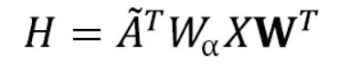

Where $W_{\alpha}$ is a matrix that stores every $a_{ij}$.

In this example, we will use the following graph from the previous chapter:

```py
import networkx as nx
UG=nx.Graph()
UG.add_edges_from([(1,2),(1,3),(3,4),(1,4)])
nx.draw_networkx(UG,
                 pos=nx.spring_layout(UG,seed=0),
                 font_color="white",
                 font_size=14,
                 node_size=1000
                 )
```
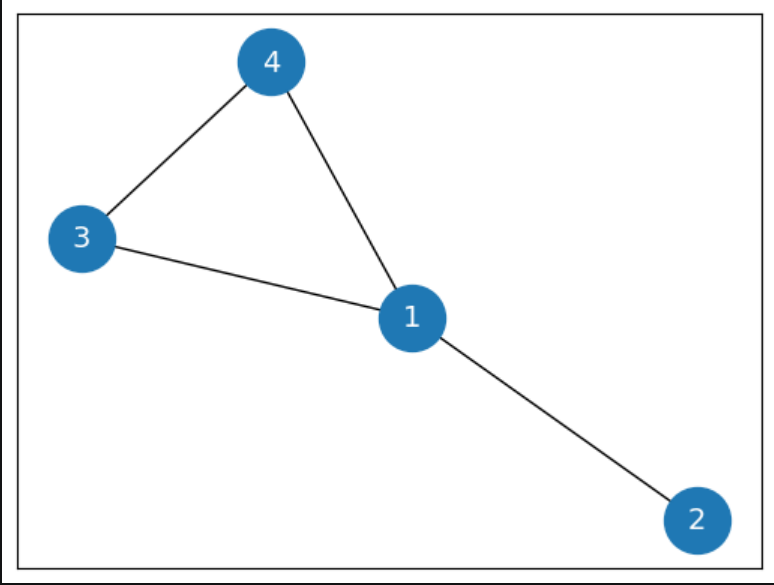
The graph must provide two important pieces of information: the adjacency matrix with self-loops  and the node features . Let’s see how to implement it in NumPy:

## GraphSAGE 
> Chapter 8
##### Scaling Up Graph Neural Networks with GraphSAGE
GraphSAGE is a GNN architecture designed to handle large graphs. In the tech industry, scalability is a key driver for growth. As a result, systems are inherently designed to accommodate millions of users. This ability requires a fundamental shift in how the GNN model works compared to GCNs and GATs. Thus, it is no surprise that GraphSAGE is the architecture of choice for tech companies such as Uber Eats and Pinterest.

In this chapter, we will learn about the two main ideas behind GraphSAGE. First, we will describe its neighbor sampling technique, which is at the core of its performance in terms of scalability. We will then explore three aggregation operators used to produce node embeddings. Besides the original approach, we will also detail the variants proposed by Uber Eats and Pinterest.

Moreover, GraphSAGE offers new possibilities in terms of training. We will implement two ways of training a GNN for two tasks – node classification with PubMed and multi-label classification for protein-protein interactions. Finally, we will discuss the benefits of a new inductive approach and how to use it.

By the end of this chapter, you will understand how and why the neighbor sampling algorithm works. You will be able to implement it to create mini-batches and speed up training on most GNN architectures using a GPU. Furthermore, you will master inductive learning and multi-label classification on graphs.

In this chapter, we will cover the following topics:
- Introducing GraphSAGE
- Classifying nodes on PubMed
- Inductive learning on protein-protein interactions
##### Introducing GraphSAGE
Hamilton et al. introduced GraphSAGE in 2017 (see item [1] of the Further reading section) as a framework for inductive representation learning on large graphs (with over 100,000 nodes). Its goal is to generate node embeddings for downstream tasks, such as node classification. In addition, it solves two issues with GCNs and GATs – scaling to large graphs and efficiently generalizing to unseen data. In this section, we will explain how to implement it by describing the two main components of GraphSAGE:
- Neighbor sampling
- Aggregation
Let’s take a look at them.
##### Neighbor sampling
So far, we haven’t discussed an essential concept in traditional neural networks – mini-batching. It consists of dividing our dataset into smaller fragments, called batches. They are used in gradient descent, the optimization algorithm that finds the best weights and biases during training. There are three types of gradient descent:
* Batch gradient descent: Weights and biases are updated after a whole dataset has been processed (every epoch). This is the technique we have implemented so far. However, it is a slow process that requires the dataset to fit in memory.
* Stochastic gradient descent: Weights and biases are updated for each training example in the dataset. This is a noisy process because the errors are not averaged. However, it can be used to perform online training.
* Mini-batch gradient descent: Weights and biases are updated at the end of every mini-batch of  training examples. This technique is faster (mini-batches can be processed in parallel using a GPU) and leads to more stable convergence. In addition, the dataset can exceed the available memory, which is essential for handling large graphs.

In practice, we use more advanced optimizers such as RMSprop or Adam, which also implement mini-batching.

Dividing a tabular dataset is straightforward; it simply consists of selecting  samples (rows). However, this is an issue regarding graph datasets – how do we choose  nodes without breaking essential connections? If we’re not careful, we could end up with a collection of isolated nodes where we cannot perform any aggregation.

We have to think about how GNNs use datasets. Every GNN layer computes node embeddings based on their neighbors. This means that computing an embedding only requires the direct neighbors of this node (1 hop). If our GNN has two GNN layers, we need these neighbors and their own neighbors (2 hops). The rest of the network is irrelevant to computing these individual node embeddings.

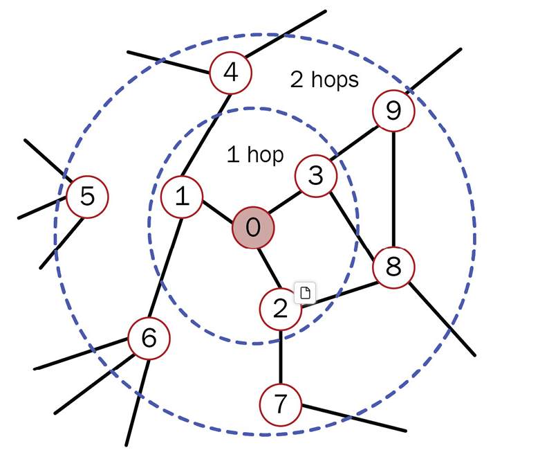
This technique allows us to fill batches with computation graphs, which describe the entire sequence of operations for calculating a node embedding. Figure 8.2 shows the computation graph of node 0 in a more intuitive representation.

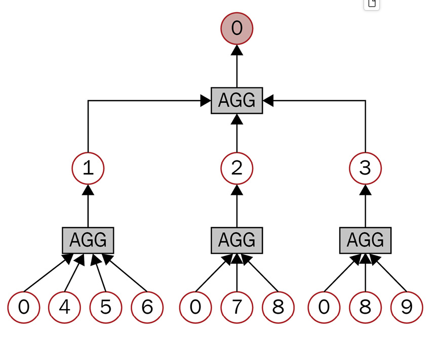
We need to aggregate 2-hop neighbors in order to compute the embedding of 1-hop neighbors. These embeddings are then aggregated to obtain the embedding of node 0. However, there are two problems with this design:
* The computation graph becomes exponentially large with respect to the number of hops
* Nodes with very high degrees of connectivity (such as celebrities on an online social network a social network), also called hub nodes, create enormous computation graphs

To solve these issues, we have to limit the size of our computation graphs. In GraphSAGE, the authors propose a technique called neighbor sampling. Instead of adding every neighbor in the computation graph, we sample a predefined number of them. For instance, we choose only to keep (at most) three neighbors during the first hop and five neighbors during the second hop. Hence, the computation graph cannot exceed  nodes in this case.

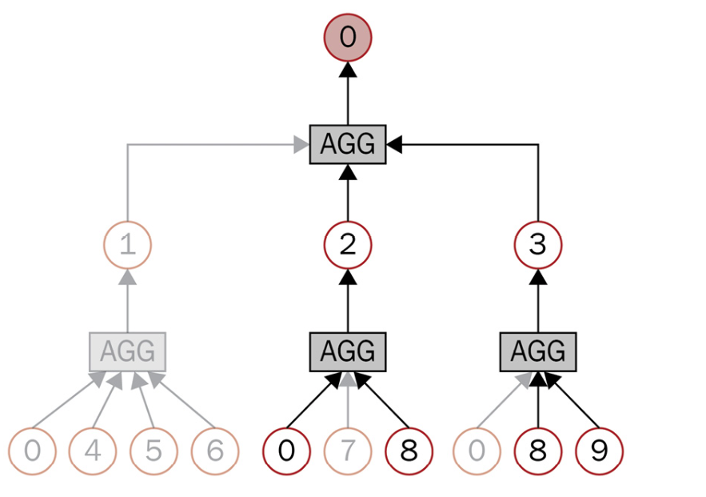

A low sampling number is more efficient but makes the training more random (higher variance). Additionally, the number of GNN layers (hops) must stay low to avoid exponentially large computation graphs. Neighbor sampling can handle large graphs, but it causes a trade-off by pruning important information, which can negatively impact performance such as accuracy. Note that computation graphs involve a lot of redundant calculations, which makes the entire process computationally less efficient.

Nonetheless, this random sampling is not the only technique we can use. Pinterest has its own version of GraphSAGE, called PinSAGE, to power its recommender system . It implements another sampling solution using random walks. PinSAGE keeps the idea of a fixed number of neighbors but implements random walks to see which nodes are the most frequently encountered. This frequency determines their relative importance. PinSAGE’s sampling strategy allows it to select the most critical nodes and proves more efficient in practice.

##### Aggregation
Now that we’ve seen how to select the neighboring nodes, we still need to compute embeddings. This is performed by the aggregation operator (or aggregator). In GraphSAGE, the authors have proposed three solutions:

* A mean aggregator
* A long short-term memory (LSTM) aggregator
* A pooling aggregator

We will focus on the mean aggregator, as it is the easiest to understand. First, the mean aggregator takes the embeddings of target nodes and their sampled neighbors to average them. Then, a linear transformation with a weight matrix, W , is applied to this result:

The mean aggregator can be summarized by the following formula, where $\sigma$ is a non-linear function such as ReLU or tanh:
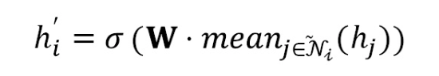

In the case of PyG’s and Uber Eats’ implementation of GraphSAGE , we use two weight matrices instead of one; the first one is dedicated to the target node, and the second to the neighbors. This aggregator can be written as follows:
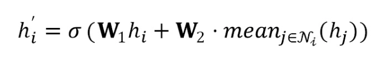
The LSTM aggregator is based on LSTM architecture, a popular recurrent neural network type. Compared to the mean aggregator, the LSTM aggregator can, in theory, discriminate between more graph structures and, thus, produce better embeddings. The issue is that recurrent neural networks only consider sequences of inputs, such as a sentence with a beginning and an end. However, nodes do not have any sequence. Therefore, we perform random permutations of the node’s neighbors to address this problem. This solution allows us to use the LSTM architecture without relying on any sequence of inputs.

Finally, the pooling aggregator works in two steps. First, every neighbor’s embedding is fed to an MLP to produce a new vector. Secondly, an elementwise max operation is performed to only keep the highest value for each feature.

We are not limited to these three options and could implement other aggregators in the GraphSAGE framework. Indeed, the main idea behind GraphSAGE resides in its efficient neighbor sampling. In the next section, we will use it to perform node classification on a new dataset.


##### Classifying nodes on PubMed
In this section, we will implement a GraphSAGE architecture to perform node classification on the PubMed dataset (available under the MIT license from https://github.com/kimiyoung/planetoid).

Previously, we saw two other citation network datasets from the same Planetoid family – Cora and CiteSeer. The PubMed dataset displays a similar but larger graph, with 19,717 nodes and 88,648 edges. Figure 8.3 shows a visualization of this dataset as created by Gephi (https://gephi.org/).
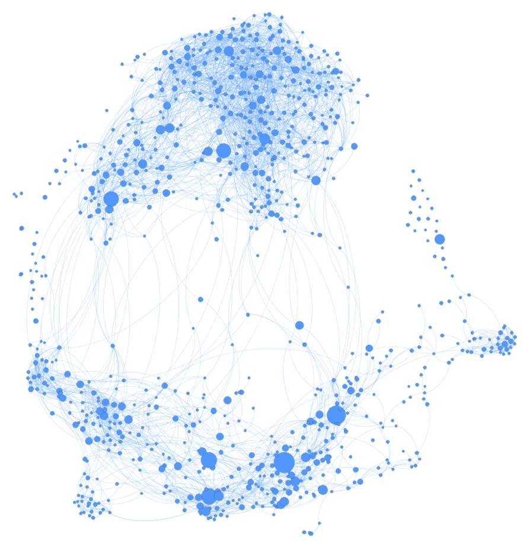

Node features are TF-IDF-weighted word vectors with 500 dimensions. The goal is to correctly classify nodes into three categories – diabetes mellitus experimental, diabetes mellitus type 1, and diabetes mellitus type 2. Let’s implement it step by step using PyG:

`Code:`https://github.com/PacktPublishing/Hands-On-Graph-Neural-Networks-Using-Python/blob/main/Chapter08/chapter8.ipynb

##### Inductive learning on protein-protein interactions
In GNNs, we distinguish two types of learning – transductive and inductive. They can be summarized as follows:

* In inductive learning, the GNN only sees data from the training set during training. This is the typical supervised learning setting in machine learning. In this situation, labels are used to tune the GNN’s parameters.
* In transductive learning, the GNN sees data from the training and test sets during training. However, it only learns data from the training set. In this situation, the labels are used for information diffusion.
The transductive situation should be familiar, since it is the only one we have covered so far. Indeed, you can see in the previous example that GraphSAGE makes predictions using the whole graph during training (self(batch.x, batch.edge_index)). We then mask part of these predictions to calculate the loss and train the model only using training data (criterion(out[batch.train_mask], batch.y[batch.train_mask])).

Transductive learning can only generate embeddings for a fixed graph; it does not generalize for unseen nodes or graphs. However, thanks to neighbor sampling, GraphSAGE is designed to make predictions at a local level with pruned computation graphs. It is considered an inductive framework, since it can be applied to any computation graph with the same feature schema.

Let’s apply it to a new dataset – the protein-protein interaction (PPI) network, described by Agrawal et al. [5]. This dataset is a collection of 24 graphs, where nodes (21,557) are human proteins and edges (342,353) are physical interactions between proteins in a human cell. Figure 8.6 shows a representation of PPI made with Gephi.

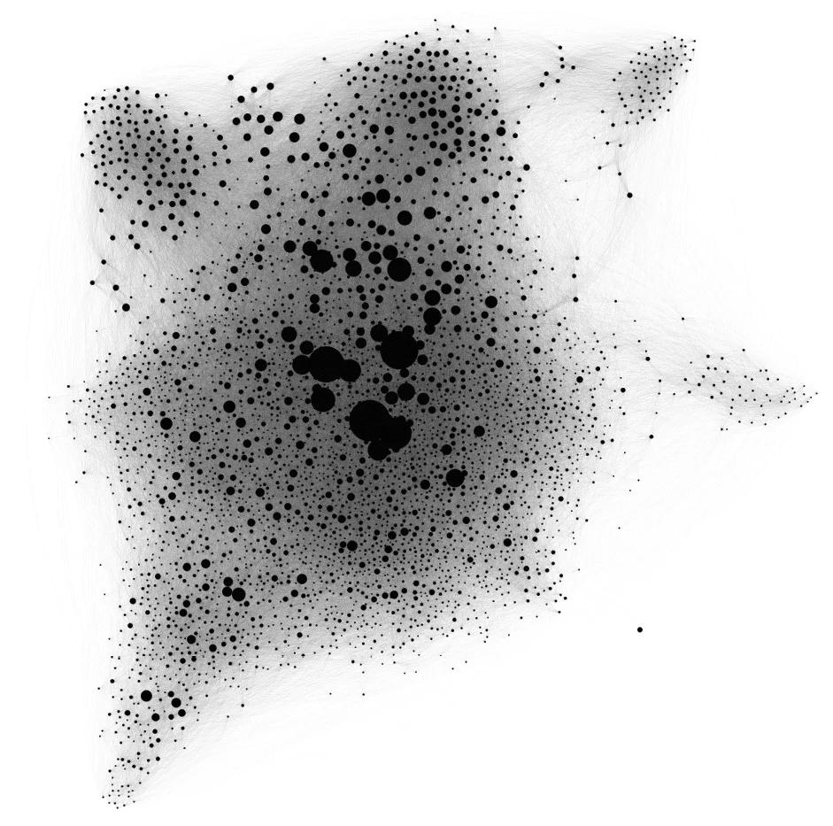
The goal of the dataset is to perform multi-label classification with 121 labels. This means that every node can range from 0 to 121 labels. This differs from a multi-class classification, where every node would only have one class.

We could also train GraphSAGE without labels using unsupervised learning. This is particularly useful when labels are scarce or provided by downstream applications. However, it requires a new loss function to encourage nearby nodes to have similar representations while ensuring that distant nodes have distant embeddings:

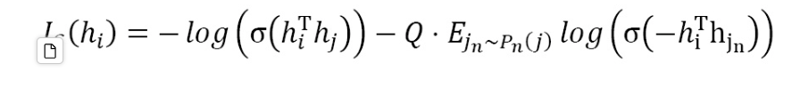

Here, $j$  is a neighbor of $u$ in a random walk, $\sigma$ is the sigmoid function, $P_n(j)$ is the negative sampling distribution for $j$, and $Q$ is the number of negative samples:

Finally, PinSAGE and Uber Eats’ versions of GraphSAGE are recommender systems. They combine the unsupervised setting with a different loss because of this application. Their objective is to rank the most relevant entities (food, restaurants, pins, and so on) for each user, which is an entirely different task. To perform that, they implement a max-margin ranking loss that considers pairs of embeddings.

If you need to scale up GNNs, other solutions can be considered. Here are short descriptions of two standard techniques:

* Cluster-GCN  provides a different answer to the question of how to create mini-batches. Instead of neighbor sampling, it divides the graph into isolated communities. These communities are then processed as independent graphs, which can negatively impact the quality of the resulting embeddings.
* Simplifying GNNs can decrease training and inference times. In practice, simplification consists of discarding nonlinear activation functions. Linear layers can then be compressed into one matrix multiplication using linear algebra. Naturally, these simplified versions are not as accurate as real GNNs on small datasets but are efficient for large graphs, such as Twitter .

## Defining Expressiveness for Graph Classification
In the previous chapter, we traded accuracy for scalability. We saw that it was instrumental in applications such as recommender systems. However, it raises several questions about what makes GNNs “accurate.” Where does this precision come from? Can we use this knowledge to design better GNNs?

This chapter will clarify what makes a GNN powerful by introducing the Weisfeiler-Leman (WL) test. This test will give us the framework to understand an essential concept in GNNs – expressiveness. We will use it to compare different GNN layers and see which one is the most expressive. This result will then be used to design a more powerful GNN than GCNs, GATs, and GraphSAGE.

Finally, we will implement it using PyTorch Geometric to perform a new task – graph classification. We will implement a new GNN on the PROTEINS dataset, comprising 1,113 graphs representing proteins. We will compare different methods for graph classification and analyze our results.

By the end of this chapter, you will understand what makes a GNN expressive and how to measure it. You will be able to implement a new GNN architecture based on the WL test and perform graph classification using various techniques.

In this chapter, we will cover the following main topics:

- Defining expressiveness
- Introducing the GIN
- Classifying graphs with GIN

##### Defining expressiveness
Neural networks are used to approximate functions. This is justified by the universal approximation theorem, which states that a feedforward neural network with only one layer can approximate any smooth function. But what about universal function approximation on graphs? This is a more complex problem that requires the ability to distinguish graph structures.

With GNNs, our goal is to produce the best node embeddings possible. This means that different nodes must have different embeddings, and similar nodes must have similar embeddings. But how do we know that two nodes are similar? Embeddings are computed using node features and connections. Therefore, we have to compare their features and neighbors to distinguish nodes.

In graph theory, this is referred to as the graph isomorphism problem. Two graphs are isomorphic (“the same”) if they have the same connections, and their only difference is a permutation of their nodes . In 1968, Weisfeiler and Lehman  proposed an efficient algorithm to solve this problem, now known as the WL test.

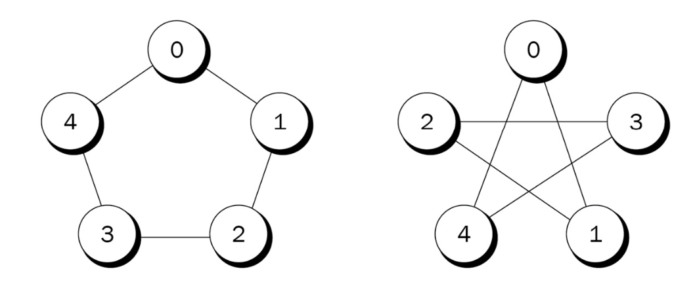

The WL test aims to build the canonical form of a graph. We can then compare the canonical form of two graphs to check whether they are isomorphic or not. However, this test is not perfect, and non-isomorphic graphs can share the same canonical form. This can be surprising, but it is an intricate problem that is still not completely understood; for instance, the complexity of the WL algorithm is unknown.

The WL test works as follows:

1. At the beginning, each node in the graph receives the same color.
2. Each node aggregates its own color and the colors of its neighbors.
3. The result is fed to a hash function that produces a new color.
4. Each node aggregates its new color and the new colors of its neighbors.
5. The result is fed to a hash function that produces a new color.
6. These steps are repeated until no more nodes change color.
The following figure summarizes the WL algorithm.
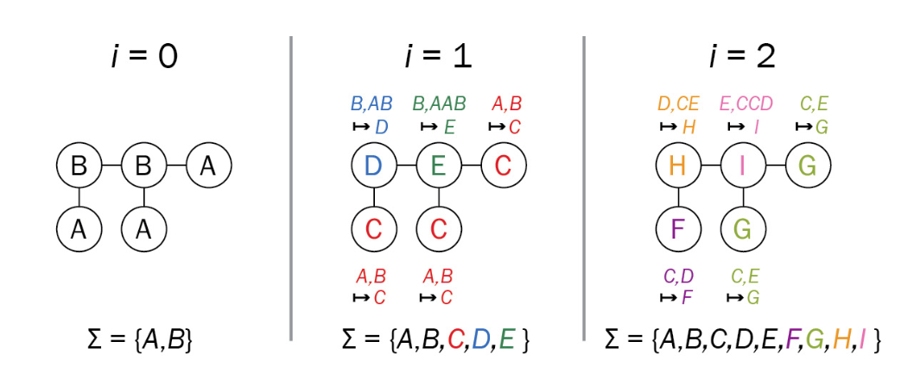
The resulting colors give us the canonical form of the graph. If two graphs do not share the same colors, they are not isomorphic. Conversely, we cannot be sure they are isomorphic if they obtain the same colors.

The steps we described should be familiar; they are surprisingly close to what GNNs perform. Colors are a form of embeddings, and the hash function is an aggregator. But it is not just any aggregator; the hash function is particularly suited for this task. Would it still be as efficient if we were to replace it with another function, such as a mean or max aggregator (as seen in Chapter 8)?

Let’s see the result for each operator:

* With the mean aggregator, having 1 blue node and 1 red node, or 10 blue nodes and 10 red nodes, results in the same embedding (half blue and half red).
* With the max aggregator, half of the nodes would be ignored in the previous example; the embedding would only consider the blue or red color.
* With the sum aggregator, however, every node contributes to the final embedding; having 1 red node and 1 blue node is different from having 10 blue nodes and 10 red nodes.
Indeed, the sum aggregator can discriminate more graph structures than the other two. If we follow this logic, this can only mean one thing – the aggregators we have been using so far are suboptimal, since they are strictly less expressive than a sum. Can we use this knowledge to build better GNNs? In the next section, we will introduce the Graph Isomorphism Network (GIN) based on this idea.
##### Introducing the GIN
In the previous section, we saw that the GNNs introduced in the previous chapters were less expressive than the WL test. This is an issue because the ability to distinguish more graph structures seems to be connected to the quality of the resulting embeddings. In this section, we will translate the theoretical framework into a new GNN architecture – the GIN.

Introduced in 2018 by Xu et al. in a paper called “How Powerful are Graph Neural Networks?” [2], the GIN is designed to be as expressive as the WL test. The authors generalized our observations on aggregation by dividing it into two functions:

* Aggregate: This function, , selects the neighboring nodes that the GNN considers
* Combine: This function, , combines the embeddings from the selected nodes to produce the new embedding of the target node

The embedding of the  node can be written as the following:
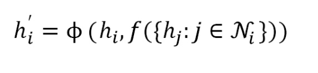

In the case of a GCN, the $f$ function aggregates every neighbor of the $i$ node,  and $\phi$ applies a specific mean aggregator. In the case of GraphSAGE, the neighborhood sampling is the $f$ function, and we saw three options for  $\phi$– the mean, LSTM, and max aggregators.

So, what are these functions in the GIN? Xu et al. argue that they have to be injective. As shown in Figure 9.3, injective functions map distinct inputs to distinct outputs. This is precisely what we want to distinguish graph structures. If the functions were not injective, we would end up with the same output for different inputs. In this case, our embeddings would be less valuable because they would contain less information.

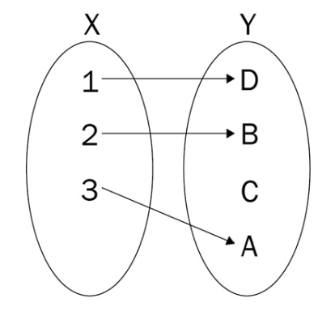

The GIN’s authors use a clever trick to design these two functions – they simply approximate them. In the GAT layer, we learned the self-attention weights. In this example, we can learn both functions using a single MLP, thanks to the universal approximation theorem:
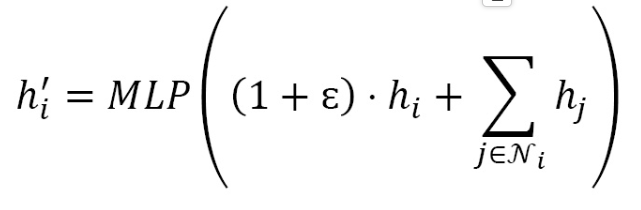
Here, $\phi$  is a learnable parameter or a fixed scalar, representing the importance of the target node’s embedding compared to its neighbors’. The authors also emphasize that the MLP must have more than one layer to distinguish specific graph structures.

We now have a GNN that is as expressive as the WL test. Can we do even better? The answer is yes. The WL test can be generalized to a hierarchy of higher-level tests known as k-WL. Instead of considering individual nodes, k-WL tests look at -tuples of nodes. It means that they are non-local, since they can look at distant nodes. This is also why (k+1)-WL tests can distinguish more graph structures than k-WL tests for k>=2.

Several architectures based on k-WL tests have been proposed, such as the k-GNN by Morris et al.While these architectures help us better understand how GNNs work, they tend to underperform in practice compared to less expressive models, such as GNNs or GATs [4]. But all hope is not lost, as we will see in the next section in the particular context of graph classification.

##### Classifying graphs using GIN
We could directly implement a GIN model for node classification, but this architecture is more interesting for performing graph classification. In this section, we will see how to transform node embeddings into graph embeddings using global pooling techniques. We will then apply these techniques to the PROTEINS dataset and compare our results using GIN and GCN models.

##### Graph classification
Graph classification is based on the node embeddings that a GNN produces. This operation is often called global pooling or graph-level readout. There are three simple ways of implementing it:

* Mean global pooling: The graph embedding  is obtained by averaging the embeddings of every node in the graph:

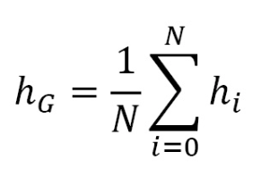

* Max global pooling: The graph embedding is obtained by selecting the highest value for each node dimension:

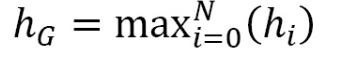

* Sum global pooling: The graph embedding is obtained by summing the embeddings of every node in the graph:
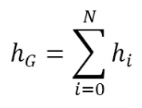